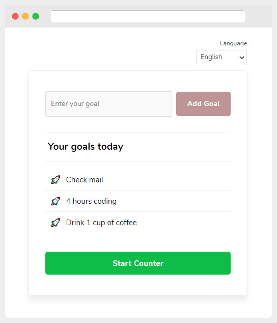

# 3 Goals of the Day

Plan your day by identifying the three most important things to focus on with counter. (i18next was used)

[Demo](https://ozknozsrt.github.io/kojs-exercises/3goalsoftheday/)

### Features
- Localization with i18next. And saves the selected language to localStorage.
- After your 3 goals has been entered, the 24-hour counter starts.
- After your 3 entering goals, the input and button disabling.
- Start Counter and Stop Counter buttons
- Marking done goals with strike-through

### Nice to have
- [ ] localStorage data and counter
- [x] Marking done goals with strike-through
- [ ] Share goals your friends
- [ ] Confetti explosion when done all goals
